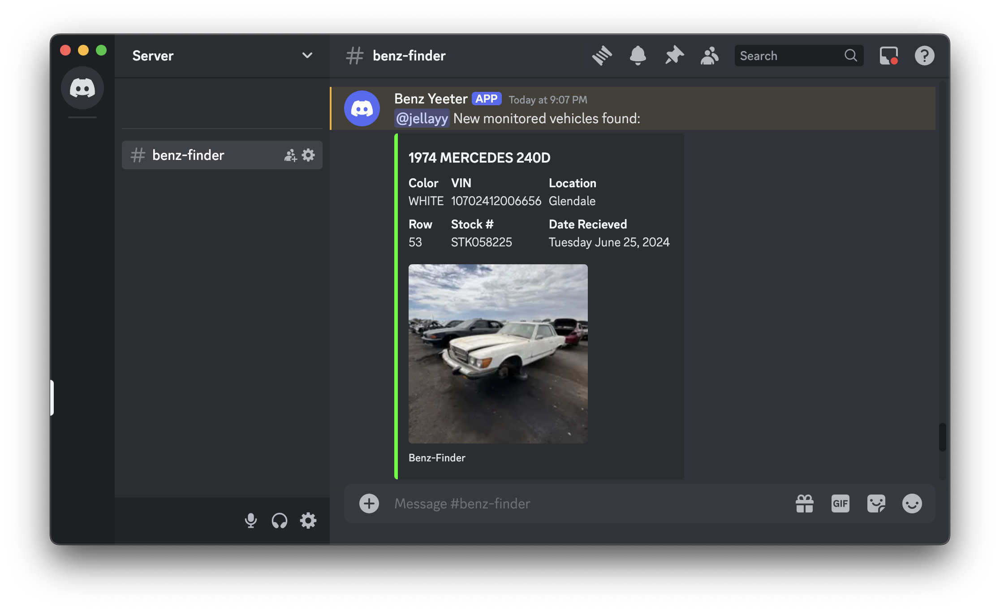

# Benz-Finder

A Python-based Docker app that periodically scrapes PullNSave locations for new vehicle inventory. It uses a database to track state, compares findings against user-defined vehicle criteria, and sends notifications via configurable channels (e.g. Discord webhooks) when matches are found.

Created out of a dire need to find any classic Mercedes that hits the lot before anyone else takes all the parts I need.



# Usage

## benz_finder.yaml

benz-finder is powered by a single YAML configuration file to declare what vehicles to search for (makes, models, and years), PullNSave locations to look at, and where to send notifications for newly found vehicles. An example configuration file can be found at [docs/example_config.yaml](https://github.com/Jellayy/benz-finder/blob/master/docs/example_config.yaml):

```yaml
vehicles: # Define vehicles to search for here
  - make: Mercedes-Benz
    models:
      - MERCEDES 300D
      - MERCEDES 240D
      - MERCEDES 450
    years:
      - 1972-1980 # Years can be represented as ranges
  - make: Honda
    models:
      - CIVIC
    years:
      - 1999 # Or individually
      - 2015

locations: # List PullNSave locations you want to search for your vechicles at here
  - Glendale
  - Phoenix - North
  - Phoenix - South
  - Gilbert
  - Mesa

notifications: # Configure any notification endpoints for found vehicles here
  - type: discord # Each notification service will have its own unique configuration
    webhook_url: "https://discord.com/api/webhooks/snip"
    message: "<@ID> New monitored vehicles found:"
```

The information provided in the `vehicles` and `locations` sections needs to match the data in PullNSave's servers or else your searches won't return results. You could scrape the network tab of the PullNSave site to do this, or you could use the included [`cli.py`](#clipy) to pull data much easier.

By default, benz-finder will look for the `benz_finder.yaml` file in the current directory. The docker image defaults to the `/benz-finder` directory. The path to the file can be changed with the `--config_file` argument:

```bash
python main.py --config_file /path/to/benz_finder.yaml
```

For a list of all supported notification channels, see [notifications](#notifications)

## cli.py

To prevent you from having to do some network tab scraping on the PullNSave website to know the values for each make, model, and location, benz-finder includes a simple cli-based tool for running helper functions: `cli.py`

- `list locations`

    List all PullNSave locations

    ```bash
    ❯ python cli.py list locations

    [{'StoreNumber': '1', 'StoreName': 'Salt Lake City', 'State': 'UT'}, ...]
    ```

- `list makes`

    List all available makes from PullNSave

    ```bash
    ❯ python cli.py list makes

    ['Acura', ...]
    ```

- `list models`

    List all available models for a make from PullNSave

    ```bash
    ❯ python cli.py list models --make Honda

    ['ACCORD', ...]
    ```

## Docker

### Docker Compose

An example docker-compose file can be found at [docs/docker_compose.yaml](https://github.com/Jellayy/benz-finder/blob/master/docs/docker_compose.yaml):

```yaml
services:
  benz-finder:
    container_name: benz-finder
    image: jellayy/benz-finder
    volumes:
      - /path/to/benz_finder:/benz_finder
    environment:
      - JOB_FREQUENCY=1d
    restart: unless-stopped
```

Before starting the container, make sure you have a `benz_finder.yaml` configuration file in the directory that you mount to `/benz_finder`

benz-finder's logfile and database will also autopopulate in this directory when the app starts.

## Notifications

### Discord

Post new vehicles to any Discord webhook with Embeds for formatting. Custom messages and any number of webhooks are supported.

Configuration file entry:
```yaml
notifications:
  - type: discord
    webhook_url: "https://discord.com/api/webhooks/snip" # Webhook URL
    message: "<@ID> New monitored vehicles found:" # Custom Message to send each time vehicles are found
```

Custom messages support mentioning users with the typical `<@ID>` format, where `ID` is swapped for the user's global ID.